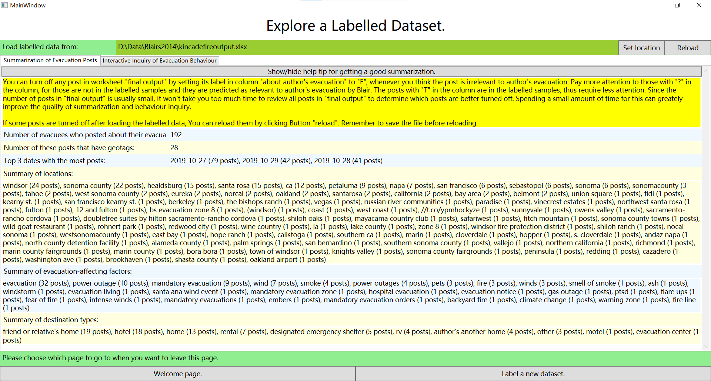
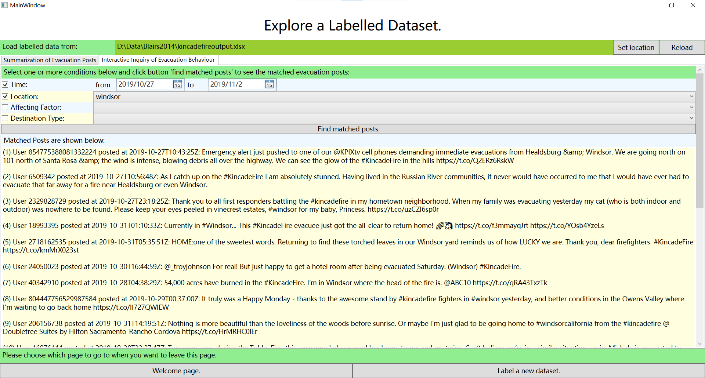

# Blair: Behavior Labelling AI for Research

Blair is an LLM-based desktop application project aimed at understanding human behavior during wildfire evacuations using social media data. Whether you're a researcher, developer, or emergency management professional, Blair provides valuable insights to enhance preparedness and response strategies.

## Features

- **Active Learning Approach**: Blair leverages active learning techniques to identify meaningful patterns in social media posts related to evacuations.
- **Data Filtering and Refinement**: Blair uses a Large Language Model (LLM) to filter out irrelevant posts, ensuring accurate data cleaning results.
- **Categorization and Summarization**: Blair categorizes and summarizes clean data, making it easy to extract actionable insights.

## Getting Started

1. **Installation**:
   - Install DotNet 6.0 runtime from this link if your windows computer has not installed it: https://dotnet.microsoft.com/en-us/download/dotnet/6.0 
   - Download the latest binary release of Blair to your windows computer. The current latest release can be found at this link:
   <https://github.com/WUI-NITY-RMIT/BLAIR-binary-releases/releases/download/windows-x64/Blair-0.0.1-beta-windows-x64.zip>
   - Unzip the downloaded zip file of the release.

2. **Usage**:
   - Navigate to the folder unzipped from the downloaded release of Blair.
   - Click the "Blair.exe" in the unzipped folder to run Blair.
   - Follow the workflow described in the Workflow section. A more detailed workflow can be found in **docs/Blair User Manual.pdf**.

3. **Contributing**:
   - We welcome collaborations, but we cannot publish the source code due to intellectual property proctection. As a result, the "source code.zip" file in each release only contains user manual, but does not contain any source code. Please contact xiangmin.zhou@rmit.edu.au for collaboration involving Blair. 

## Workflow

1. **Data Collection**:
   - Collect the posts using a hashtag relevant to a bushfire event from social media platforms (we recommend using rtweet in R to collect tweets), and store the posts in a CSV file that has columns including id, user id, geo bounding box, and text. An example csv file is shown below:
   ```
    id,user id,time,geo bounding box,text
    1191787438454104065,711946640362332160,2019-11-05T18:40:42Z,|||||||,"If you would like to help undocumented workers affected by the #KincadeFire, you can donate to @UndocuFund: https://t.co/gDEoXT9OwR"
    1216176094908338176,1047322954843877376,2020-01-12T01:52:31Z,|||||||,"2 Aussie wildfires merge into an inferno 6 times the size of the #KincadeFire...ufff... https://t.co/d6DJKn9TiL"
    1199491833719427073,1090606562505240576,2019-11-27T00:55:13Z,-122.799587921103|-122.799587921103|-122.799587921103|-122.799587921103|38.6606496763912|38.6606496763912|38.6606496763912|38.6606496763912,"Toured a bit of the destruction from the #KincadeFire yesterday. So painful seeing all of the black adorning my hometown’s hills. The sight of what’s left at Soda Rock was especially rough. Many good memories made in this historic spot. https://t.co/T7FymbPW8s"
    ...
   ``` 

2. **LLM-Based Data Filtering**:
   - Set the CSV file as the input data of Blair, and click a start buttion in Blair to use the LLM to remove irrelevant posts, ensuring accurate initial data cleaning results.

3. **Active Learning-Based Data Refinement**:
   - Blair iteratively selects informative samples for labeling, learn from your labels on some small samples to improve data accuracy.

4. **Data Categorization and Summarization**:
   - Blair categorizes and summarizes clean data.

## Example Results:
The following screenshot shows the summary of Blair's output on a 2015 bushfire event called Kincade Fire. 

The screenshot below shows the tweets found by Blair that were posted in the first week of Kincade Fire and mentioned Windsor (a place affected by Kincade Fire).


## License

Blair is released under the MIT License. We only release binaries of Blair. If you would like to collaborate with us 

## Acknowledgments

This project is sponsored by WUI-NITY, which is an integrated software platform designed for simulating wildland-urban interface (WUI) evacuation scenarios. WUI-NITY provides a modeling framework to simulate both human behavior and fire dynamics during wildfire evacuations. The goal is to enhance situational awareness for responders and residents in evacuation situations. The official website of WUI-NITY can be visited at: 

<https://www.nfpa.org/education-and-research/research/fire-protection-research-foundation/projects-and-reports/wuinity-a-platform-for-the-simulation-of-wildlandurban-interface-fire-evacuation>

We also thank RMIT university for their support.

Let's make evacuation planning smarter with Blair! 🚀🔥
